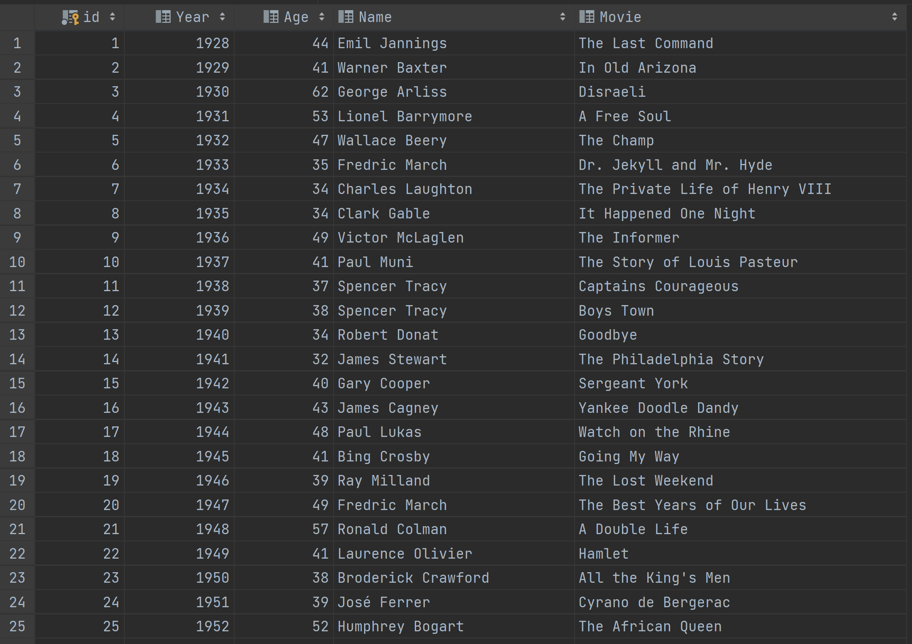

# Project Description

This is Project 3 of IS 601. This project is about to setup Pycharm with Docker, Flask, MYSQL.
In this project, created a [REST - Representational state transfer](https://en.wikipedia.org/wiki/Representational_state_transfer) API and use Postman to test the GET, POST, PUT, and DELETE request methods to retrieve, create, update, and delete records.

# Screenshots:

## 1. Web Application Outputs:
[Click Here to open PDF](Project%203.pdf)

## 2. SQL Database Screenshot:

## 3. Docker Logs after successful run:

## 4. Flask successful run:

## 5. Database Connected:

# Useful Links

[Reference - Project 3](https://github.com/kaw393939/PythonDockerFlaskPycharm/tree/lesson4)
