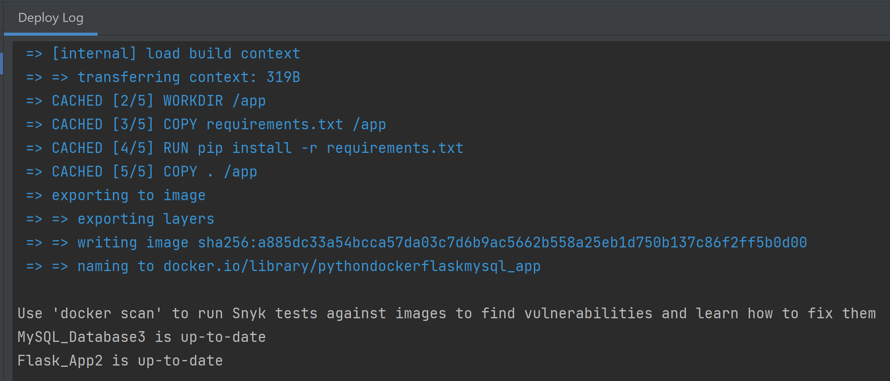
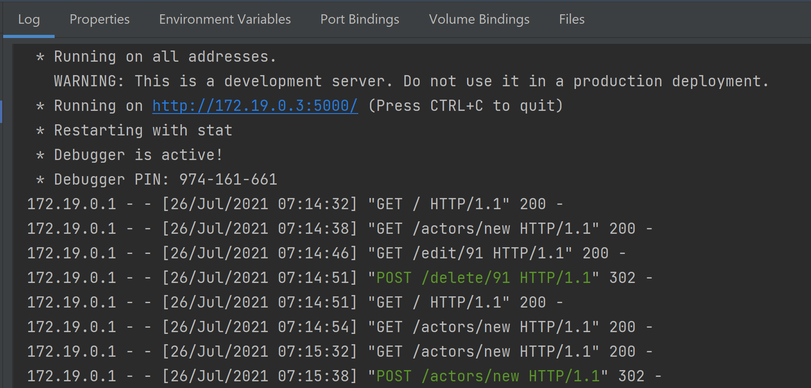
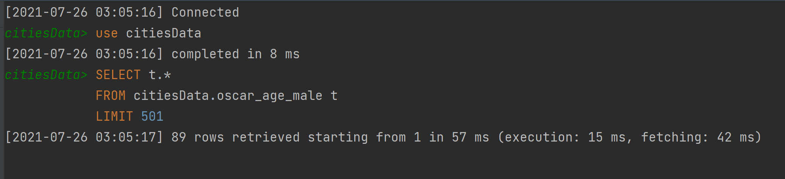

# Project Description

This is Homework 4 of IS 601. This project is about to setup Pycharm with Docker, Flask, MYSQL.

# Screenshots:

## 1. Postman Screenshot:

## 2. SQL Database Screenshot:

## 3. Docker Logs after successful run:

## 4. Flask successful run:

## 5. Database Connected:
